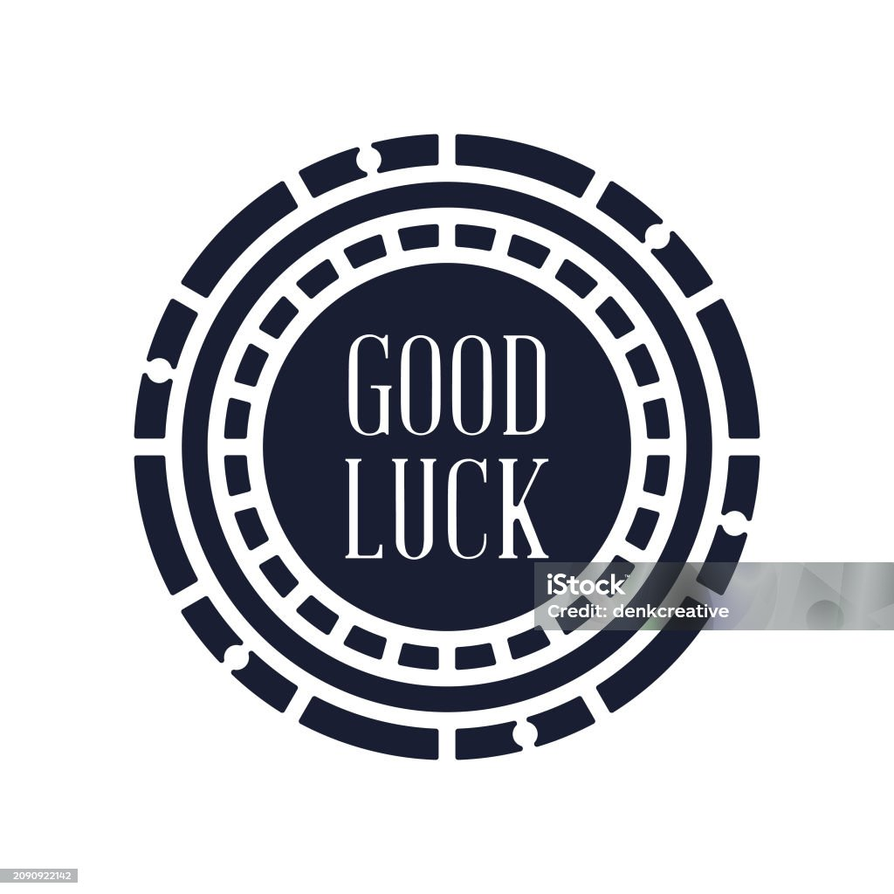

# Easy Poker Manager



## 🃏 Overview

Easy Poker Manager is a complete web application designed to manage poker tournaments with an intuitive interface. It helps tournament organizers track blinds, manage players, and visualize tournament statistics in real-time.

## ✨ Features

- **Tournament Configuration**: Set up your tournament with customizable buy-in, stack, re-buy, and add-on options
- **Level Management**: Create and manage blind levels with customizable durations and break times
- **Player Tracking**: Add players, track their stacks and expenses
- **Real-time Timer**: Professional tournament timer with automatic level progression
- **Statistics Dashboard**: Visualize player status, prize distribution, and chip statistics
- **Fully Responsive**: Works perfectly on desktop, tablet, and mobile devices

## 🖥️ Screenshots


## 🔧 Technologies Used

- **Vue 3**: Frontend framework with Composition API
- **Pinia**: State management
- **Vue Router**: Navigation and routing
- **Chart.js**: Data visualization
- **SCSS/CSS**: Styling

## 📋 Requirements

- Node.js 18+
- npm 8+

## 🚀 Installation

```bash
# Clone the repository
git clone https://github.com/mister-nothing00/SmallBlind.git

# Navigate to project directory
cd SmallBlind

# Install dependencies
npm install

# Run development server
npm run dev
```

## 📱 Building for Production

```bash
# Build for production
npm run build

# Preview production build
npm run preview
```

## 🏗️ Project Structure

```
SmallBlind/
├── public/                  # Static assets
│   ├── sound/               # Audio files for notifications
│   └── favicon.ico          # Site favicon
├── src/                     # Source code
│   ├── assets/              # Images and style assets
│   ├── components/          # Vue components
│   │   ├── ProgressOne.vue  # Blind level information component
│   │   ├── ProgressTwo.vue  # Timer component
│   │   ├── State.vue        # Player status component
│   │   └── Statistics.vue   # Tournament statistics component
│   ├── router/              # Vue Router configuration
│   ├── store/               # Pinia store
│   │   └── tournamentStore.js # Tournament data store
│   ├── views/               # Page components
│   │   ├── CreateTournament.vue # Tournament setup page
│   │   ├── LevelsPage.vue   # Blind levels configuration
│   │   ├── PlayersPage.vue  # Player management
│   │   └── TimerPage.vue    # Timer and statistics view
│   ├── App.vue              # Main app component
│   └── main.js              # Application entry point
├── index.html               # HTML entry point
└── package.json             # Project configuration
```

## 📊 Planned Features

- Tournament history and statistics
- Multiple tournament support
- Export/Import tournament configurations
- Dark/Light theme options
- Printable tournament summaries
- Offline support

## 🤝 Contributing

Contributions, issues, and feature requests are welcome! Feel free to check the [issues page](https://github.com/mister-nothing00/SmallBlind/issues).

## 📄 License

This project is [MIT](LICENSE) licensed.

## 👤 Author

**Francesco Davide di Vita**

- GitHub: [@mister-nothing00](https://github.com/mister-nothing00)

---

## 🙏 Acknowledgments

- Thanks to all poker enthusiasts who provided feedback
- Special thanks to the Vue.js and Pinia communities
